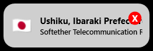
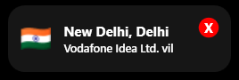
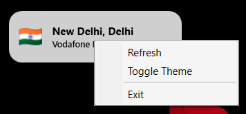

# 📌 **VPN Widget (Windows)**
A lightweight floating widget that shows **real-time VPN IP, ISP & Location** with auto-refresh, dark mode, and autostart—built in WPF (.NET).

<p align="center">
  
</p>

---

## ⚡ Highlights
- 📍 Shows IP, Country, City, ISP in real-time
- 🌑 / 🌕 Dark & Light theme toggle
- 📌 Always on top small widget
- 🔁 Auto refresh every 30s
- 🖥 Start with Windows (autostart)
- 💾 Minimal install size (~800KB with setup)

---

## 📥 Download
**👉 Latest Release:**  
https://github.com/itzpa1/VPNWidget/releases

**Installer:** `VPNWidget-Setup.exe`  
Runs instantly & starts at login.

---

## 🧑‍💻 Author & Credits
| Role | Information |
|------|--------------|
| **Developer** | `code.itzpa1` |
| **Skills** | App / Web Developer |
| **Instagram** | https://instagram.com/code.itzpa1 |
| **GitHub** | https://github.com/itzpa1 |
| **Project** | VPN IP & Location Floating Widget |
| **Year** | © 2025 |

---

## 🏗 Build & Publish Commands (All in One)

### 📍 Build for Development (Visual Studio)
```
git clone https://github.com/itzpa1/VPNWidget.git
cd VPNWidget
```
Open `.sln` → Build.

### 📦 Minimal Publish (Requires .NET installed on user PC)
```bash
dotnet publish -c Release -r win-x64 --self-contained=false -o publish
```

### 🗜 Single Executable (Standalone EXE)
```bash
dotnet publish -c Release -r win-x64 ^
-p:PublishSingleFile=true ^
-p:IncludeNativeLibrariesForSelfExtract=true ^
-p:PublishTrimmed=true -o publish
```

### 🧱 Full Standalone (No .NET Needed)
```bash
dotnet publish -c Release -r win-x64 --self-contained=true -o publish
```

---

## 📦 Installer Build (Inno Setup)
```
1. Open Installer/setup.iss
2. Build → Compile
3. Output: /Output/VPNWidget-Setup.exe
```

📍 Setup auto-adds:
- Desktop Shortcut (optional)
- Autostart with Windows
- Credit screen after install

---

## 📸 Screenshots (Add later)
| Widget | Dark Mode | Light Mode | Context Menu |
|--------|------------|-------------|------------|
|  |  |  |  |

---

## 📜 License (MIT)
```
MIT License | Copyright (c) 2025

Permission is hereby granted, free of charge, to use, modify, and distribute.
Software is provided "AS IS" without warranty of any kind.
```

---

## 🚀 Release Checklist (FOR YOU)
```
✔ dotnet publish (win-x64)
✔ Build Inno Setup installer
✔ Create GitHub Release
✔ Upload: VPNWidget-Setup.exe + Screenshots
✔ Add version tag (v1.0.0)
```

---

## ⭐ Support
If you like this project:
```
⭐ Star the repository
🛠️ Contribute or open issues
```
Repo: https://github.com/itzpa1/VPNWidget

---
